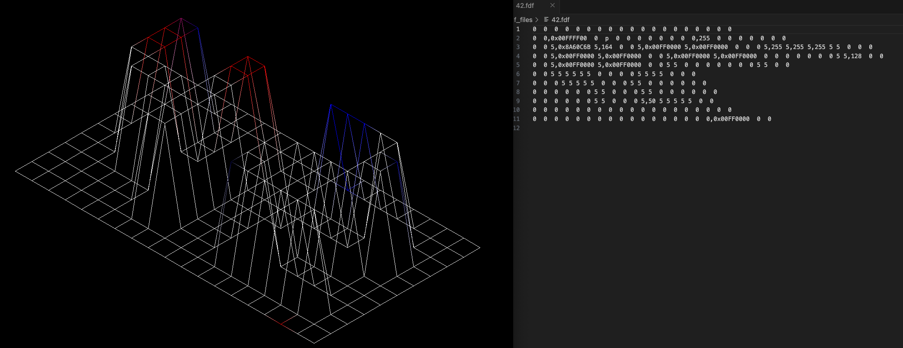

<!-- ABOUT THE PROJECT -->
## FDF

A team project to create a 3D game by imitating "Wolfenstein 3D".
This is one of my favorite projects. The player can move forward, backward, left, and right in a three-dimensional space based on the given map data.  
We use the graphic library (miniLibX made by 42) and work on Ray-Casting techniques.

